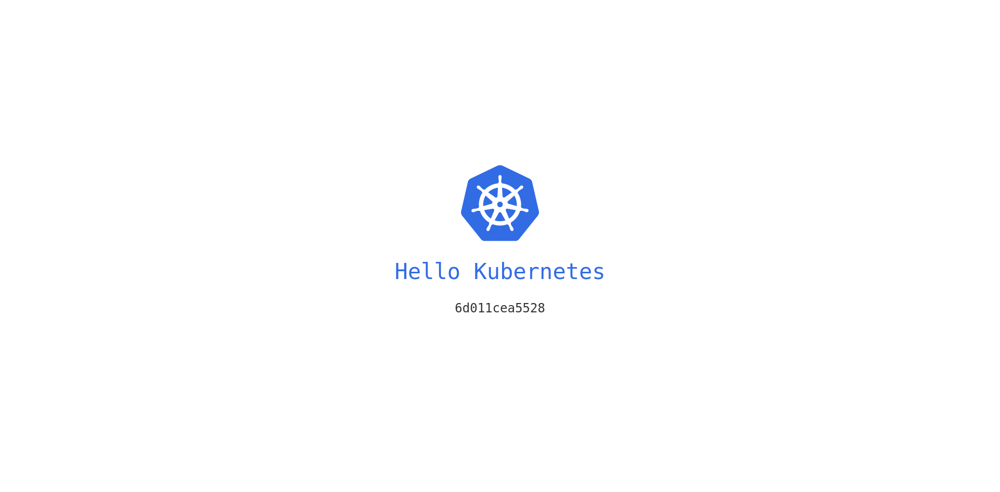

# Hello Kubernetes

Small (17MB) and fast image written in golang which can be deployed on a Kubernetes cluster. When accessed via a web browser it will display:

- a "Hello Kubernetes" message
- the pod name



The default port of 8080 can be overriden using the PORT environment variable.

## DockerHub

It is available on DockerHub as [naueramant/hello-kubernetes](https://hub.docker.com/r/naueramant/hello-kubernetes)

## Deploy

### Standard Configuration

Deploy to your Kubernetes cluster using the hello-kubernetes.yaml, which contains definitions for the service and deployment objects:

```yaml
# hello-kubernetes.yaml
apiVersion: v1
kind: Service
metadata:
  name: hello-kubernetes
spec:
  type: LoadBalancer
  ports:
  - port: 80
    targetPort: 8080
  selector:
    app: hello-kubernetes
---
apiVersion: apps/v1
kind: Deployment
metadata:
  name: hello-kubernetes
spec:
  replicas: 3
  selector:
    matchLabels:
      app: hello-kubernetes
  template:
    metadata:
      labels:
        app: hello-kubernetes
    spec:
      containers:
      - name: hello-kubernetes
        image: naueramant/hello-kubernetes
        ports:
        - containerPort: 8080
```

```sh
$ kubectl apply -f yaml/hello-kubernetes.yaml
```

### Specify Custom Port

By default, the hello-kubernetes app listens on port 8080. If you have a requirement for the app to listen on another port, you can specify the port via an env variable with the name of PORT. Remember to also update the containers.ports.containerPort value to match.

Here is an example:

```yaml
apiVersion: apps/v1
kind: Deployment
metadata:
  name: hello-kubernetes-custom
spec:
  replicas: 3
  selector:
    matchLabels:
      app: hello-kubernetes-custom
  template:
    metadata:
      labels:
        app: hello-kubernetes-custom
    spec:
      containers:
      - name: hello-kubernetes
        image: naueramant/hello-kubernetes
        ports:
        - containerPort: 80
        env:
        - name: PORT
          value: "80"
```

## Insperation

This repository mostly just contains a re-write of [paulbouwer/hello-kubernetes](https://github.com/paulbouwer/hello-kubernetes) so thanks a lot to paulbouwer for the original project!

The reason i wanted to re-write it was simply to get rid of the bloated NodeJS runtime image and use Golang instead.
